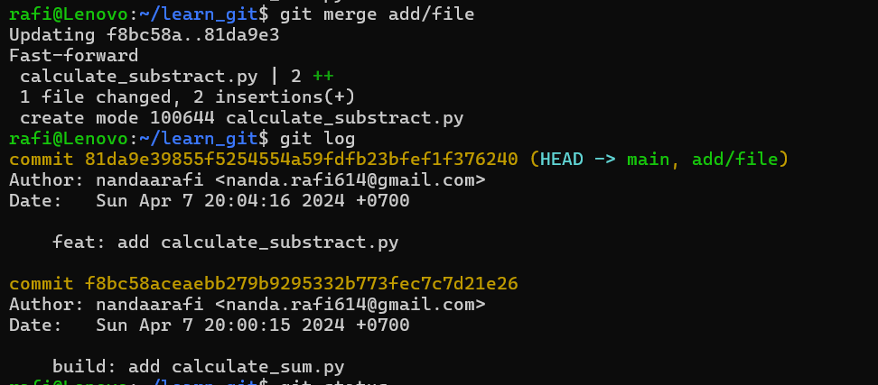

# Learn GIT

1.  git init
2.  git config --global user.email "nanda.rafi614@gmail.com"
3.  git config --global user.name "nandaarafi"
4.  git status
5.  git add .
6.  git commit -m "initial commit"
7.  git log
8.  git branch -M main
9. git branch
10.  git checkout -b add/file
11.  git status
12.  git add .
13.  git commmit -m "feat: add calculate_substract.py"
14.  git checkout main
15.  git branch
16.  git log
17.  git checkout main
18.  git merge add/file
19.  git add .
20.  git commit -m "feat: add README.md"
21.  git remote add origin https://github.com/nandaarafi/learn_git.git
22.  git checkout -b fix/error
23.  git pull origin main --allow-unrelated-histories
24.  git add .
25.  git commit -m "error: fix README.md conflict"
26.  git push origin fix/error
_____
1. **How to commit local git**
```bash
git init
git status
git add .
git commit -m "build: add calculate_sum.py"
```


2. **Checkout New Branch and commit new file**
```bash
git checkout -b add/file
git add .
git commmit -m "feat: add calculate_substract.py"
```


3. **Merge Local Branch No Conflict**
```bash
git checkout main
git merge add/file
```



4. **Git pull remote branch with conflict case**
```bash
git checkout -b fix/error
```
**Change to new branch if something happen when git pull or use git stash push before you commit to save your file**
```bash
git pull origin main --allow-unrelated-histories
git status
```


**Resolve it**


5. **Git add and commit after you resolve the conflict**
```bash
git add .
git commit -m "error: README.md conflict"
```

6. **Instead of pushing directly to the main branch, push your changes to a staged branch or a new branch dedicated to development** 
```bash
git push origin fix/error
```


- Make a Pull Request for merge branch fix/error to main
- Done you can solve merge when conflict, of course this is just small codebase, if you have bigger codebase the your conflict became more complex

PS: git cherry-pick for select specific commit to merge to main/production code base

